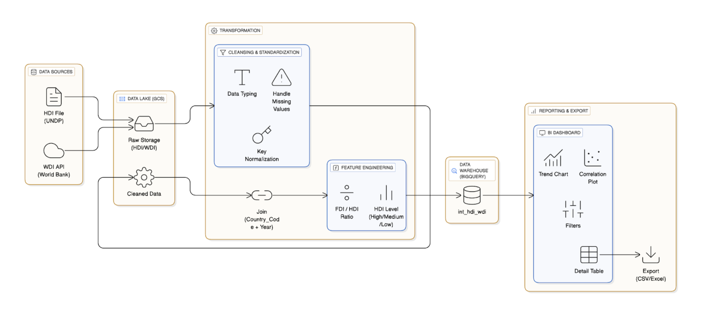

# POC: ASEAN Economics Data Platform

This Proof of Concept (POC) builds a data pipeline for 10 ASEAN countries, combining Human Development Index (HDI) metrics from UNDP and macroeconomic indicators (WDI) from the World Bank to support analytics and BI visualization.

## Architecture overview



Main flow: Ingestion (API/file) ➜ Transform (standardize + join) ➜ Load (data lake/warehouse) ➜ BI/Export.

## Components and stack
- Orchestrator: Apache Airflow 2.10.3 (CeleryExecutor) via `archive/docker-compose.yaml`.
- Language: Python (pandas, requests) for ingestion/transform jobs.
- Temporary storage: `data/` folder (raw/cleaned) in-repo for the POC; production direction can push to S3/GCS/DWH.
- Notebook: `notebooks/` for data exploration and transformation experiments.

## Data sources
- **UNDP HDI API**: `https://hdrdata.org/api/CompositeIndices/query-detailed` (indicators `hdi`, `le`, `mys`) for 10 ASEAN countries. Sample data stored at `data/raw/undp_hdi_data_raw.csv`.
- **World Bank WDI API**: `https://api.worldbank.org/v2/country/all/indicator/NY.GDP.PCAP.CD` (GDP per capita) and other economic indicators (planned expansion).

## POC pipeline (current)
- **Ingestion**: DAG `asean_economics_etl_manual_test` (Airflow) runs `airflow/dags/down_data.py` to call the UNDP API and save raw files.
- **Transform (planned)**:
	- Standardize numeric types for metrics.
	- Normalize the `Country_Code` + `Year` key between HDI and WDI.
	- Create the feature $FDI_{to\_HDI\_Ratio} = \frac{FDI\_Net\_Inflows}{HDI\_Value}$ and classify `HDI_Level` (High/Medium/Low).
- **Load**: push integrated data to a lake/warehouse (S3/GCS/BigQuery depending on environment) or write cleaned CSVs.
- **BI/Export**: dashboard (Looker Studio/Tableau/Power BI) with country/year filters; support CSV/XLSX export from the detail table.

## Main folder structure
- `airflow/`: place for DAGs, plugins (currently empty; sample DAG lives in `archive`).
- `archive/`: full Airflow POC (`docker-compose.yaml`, `.env`, DAG `asean_economics_etl_bidaily.py`, script `down_data.py`).
- `config/`: holds `settings.yaml`, `creds.yaml`, `logging.conf` (templates currently empty for you to fill).
- `data/`: POC data (`raw/` holds HDI CSV, `cleaned/` to store post-transform outputs).
- `docker/`: placeholder for Dockerfile/requirements for the main environment (not configured yet).
- `src/ingestion|transform|load|utils/`: production code scaffold (empty, to be implemented).
- `notebooks/`: exploration/EDA notebooks.
- `tests/`: place for unit/integration tests.

## Quickstart
1) Create a feature branch: `git checkout -b "feature/<short-description>"`
2) Set up local env (from repo root):
	```bash
	python -m venv .venv
	source .venv/bin/activate
	pip install -r requirements.txt
	```
3) Logging: `config/logging.conf` is loaded by `src/utils/logger.py`; logs go to `logs/app.log` (folder auto-created and gitignored). Adjust levels/rotation in that file if needed.
4) Use helper scripts (repo root):
   - **macOS/Linux**: `make start`, `make stop`, `make restart`, `make logs`, `make lint`, `make test`
   - **Windows**: `run.bat start`, `run.bat stop`, `run.bat restart`, `run.bat logs`, `run.bat lint`, `run.bat test`
   - **All OS**: `python -m src.ingestion.fetch_hdi` or `python -m src.ingestion.fetch_wdi` (local test)

## Configuration and customization
- Populate connection/secret values in `config/creds.yaml` and `config/settings.yaml` (currently empty).
- When extending DAGs, place files in `airflow/dags/` (or move the sample DAG from `archive/`).
- Update `docker/` with Dockerfile and requirements when standardizing the main build environment.

## Coding convention & Git flow
- Please follow the coding guideline: [Coding convention](https://shorturl.at/89mGV)
- Please follow the branching rules: [Git flow branching rules](https://shorturl.at/hlx6m)

## Pull request checklist (suggested)
- [ ] Branch named `feature/<short-description>` and rebased on the target branch
- [ ] Logging uses the shared logger; no stray prints; noisy logs removed
- [ ] Tests added/updated and `make test` (or `pytest`) passes
- [ ] Linting passes (`make lint`)
- [ ] Docs/config updated if behavior or interfaces changed
- [ ] No secrets or generated data committed (`config/creds*`, `data/raw`, `logs/`, large artifacts)


